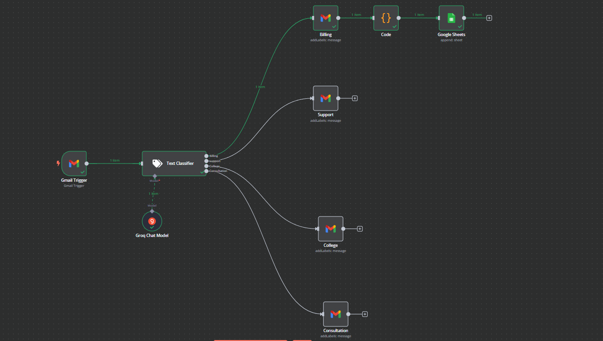

# n8n-Gmail-Agent-workflow
  

##  Project Overview  
This is an automated workflow built in **n8n** that:  
- 📩 Triggers on new emails via **Gmail**  
- 🤖 Classifies emails using **Groq AI**  
- 🧾 Extracts invoice details from email content  
- 📊 Stores extracted data in **Google Sheets**  

---

## 🚀 Workflow Overview  
This workflow is designed to process emails and classify them into different categories:  
1. **Gmail Trigger:** Captures incoming emails.  
2. **Text Classification (Groq AI):** Determines the type of email.  
   - **Billing (Invoices)**
   - **Support**
   - **College**
   - **Consultation** (if applicable)  
3. **Processing Based on Category:**  
   - **Billing:** Extracts invoice details and stores them in Google Sheets.  
   - **Other Categories:** Labels and stores them accordingly.  

---

## 🖼 Workflow Screenshot  
  

> *This image shows the complete n8n workflow setup, including Gmail trigger, classification, and data storage.*  

---

## 📥 Installation & Usage  

### **Step 1: Clone the Repository**  
```sh
git clone https://github.com/your-username/n8n-email-automation.git
cd n8n-email-automation```
```
### **Step 2: Import Workflow into n8n**
  1. Open n8n in your browser.
  2. Click on Import Workflow.
  3. Select and upload the n8n-workflow.json file.
### Step 3: Configure Credentials
  1. Set up Gmail API access for email retrieval.
  2. Add Groq AI API Key for classification.
  3. Link Google Sheets API for data storage.
### Step 4: Run the Workflow

